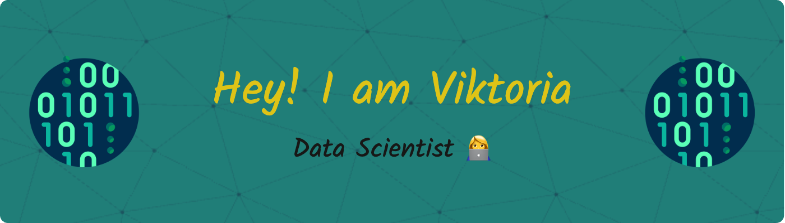

<p align="center">
 <a href="https://www.linkedin.com/in/victoriagagua/"></a>
 <a href="mailto:gaguavictoria@gmail.com"></a>
</p>

## 🎓  MSc in Data Science (Barcelona School of Economics — jointly with UPF & UAB)
### Main coursework: Machine Learning · Econometrics · Applied Maths & Statistics · Causal Inference · NLP · Deep Learning · Time‑Series Analysis

```python
class Viktoria:
    def __init__(self):
        self.name = "Viktoria Gagua"
        self.education = [
            "MSc Data Science, Barcelona School of Economics (GPA 8.51/10)",
            "BA Social Science—Economics & Finance, Free University of Tbilisi (GPA 3.8/4)"
        ]
        self.interests = [
            "Data Science",
            "Fintech",
            "Machine Learning",
            "Time‑Series Forecasting",
            "Causal Inference",
            "Deep Learning"
        ]
        self.languages = {"Georgian": "native", "English": "fluent", "Spanish": "basic"}
        self.tools = [
            "Python", "SQL", "R", "Power BI + DAX",
            "PostgreSQL", "MS SQL Server", "Oracle",
            "Git / GitHub"
        ]

    def previous_focus(self):         
        return (
            "Machine Learning and NLP projects at BSE\n"
            "Consulting on merchant analytics in fintech"
        )

```

## 🔭 Recent Work Experience

- 🏦 TBI Bank (Consultant) — Built an interactive merchant‑KPIs analytics suite and an RFM‑based early‑warning system that re‑activated **30 % of dormant merchants** in 3 months. 

- 📈 Bank of Georgia — Used SQL‑driven audience segmentation and A/B testing to lift marketing‑campaign ROI; mentored a junior analyst on workflows and data culture. 

- 📊 TBC Insurance — Developed Power BI dashboards covering corporate, retail, and SME channels, automated monthly sales reports, and provided industry‑trend analyses for leadership. 

- 🛠️ EPAM Systems — Data Engineering Lab — Designed relational schemas, ETL pipelines, and a cloud data‑warehouse prototype, gaining end‑to‑end data‑management experience. 

## 🛠️ Languages & Tools


<br>


<br>


## 📦  Python Tool‑Kit


## 📂 Featured Projects

[](https://github.com/Viktoriag27/formula1-hotel-pricing-analysis)  
<sub>**DiD + NLP** reveal how Formula 1 weekends send Barcelona hotel prices soaring.</sub>

[](https://github.com/Viktoriag27/UNGA-SDG-TextMining)  
<sub>TF‑IDF mining of UNGA speeches tracks Sustainable Development Goal discourse over decades.</sub>

[](https://github.com/Viktoriag27/nlp-toxicity-classification-analysis)  
<sub>BERT vs. rule‑based baselines for online‑toxicity detection, with augmentation & model distillation.</sub>


## 🤝🚀  Open to Collabs & Projects!

---

### 📊 GitHub Stats:
<p align="center">  </p> ```
